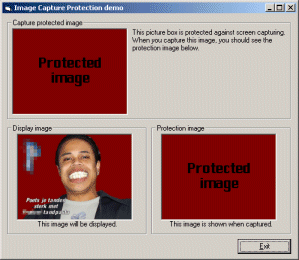

<div align="center">

## ScreenCapture Protection


</div>

### Description

This demonstration program shows you a simple, but effective method to prevent users from capturing your picture box. When a user captures the screen, an entirely different image appears in your picture box.

I am working on an ActiveX component version of this application. It will retreive the picture from a secret internet location, and display it to the user in Internet Explorer. This way, websites can protect their images from copying and capturing. (Just like TerraServer.com had in the beginning.)

Please vote for this submission to support the development of this open-source tool.
 
### More Info
 
None. See demonstration program.


<span>             |<span>
---                |---
**Submitted On**   |2001-11-05 14:13:32
**By**             |[Robin Schuil](https://github.com/Planet-Source-Code/PSCIndex/blob/master/ByAuthor/robin-schuil.md)
**Level**          |Advanced
**User Rating**    |4.2 (21 globes from 5 users)
**Compatibility**  |VB 4\.0 \(32\-bit\), VB 5\.0, VB 6\.0
**Category**       |[Graphics](https://github.com/Planet-Source-Code/PSCIndex/blob/master/ByCategory/graphics__1-46.md)
**World**          |[Visual Basic](https://github.com/Planet-Source-Code/PSCIndex/blob/master/ByWorld/visual-basic.md)
**Archive File**   |[ScreenCapt333791152001\.zip](https://github.com/Planet-Source-Code/robin-schuil-screencapture-protection__1-28656/archive/master.zip)

### API Declarations

```
Private Declare Function BitBlt Lib "gdi32" Alias "BitBlt" (ByVal hDestDC As Long, ByVal x As Long, ByVal y As Long, ByVal nWidth As Long, ByVal nHeight As Long, ByVal hSrcDC As Long, ByVal xSrc As Long, ByVal ySrc As Long, ByVal dwRop As Long) As Long
Private Declare Function SleepEx Lib "kernel32" Alias "SleepEx" (ByVal dwMilliseconds As Long, ByVal bAlertable As Long) As Long
```


